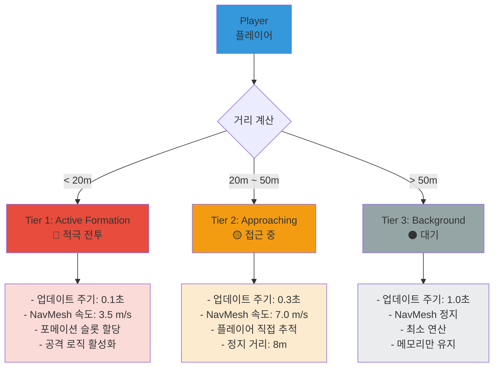
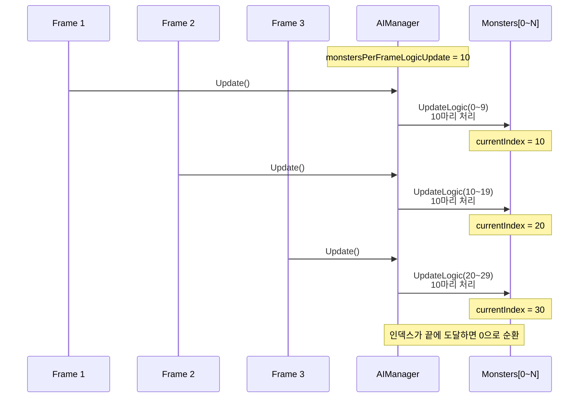
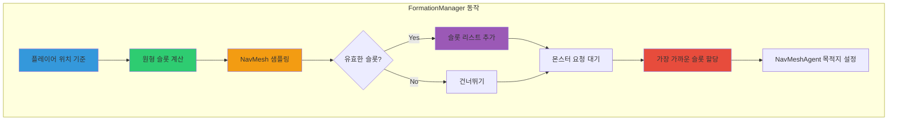
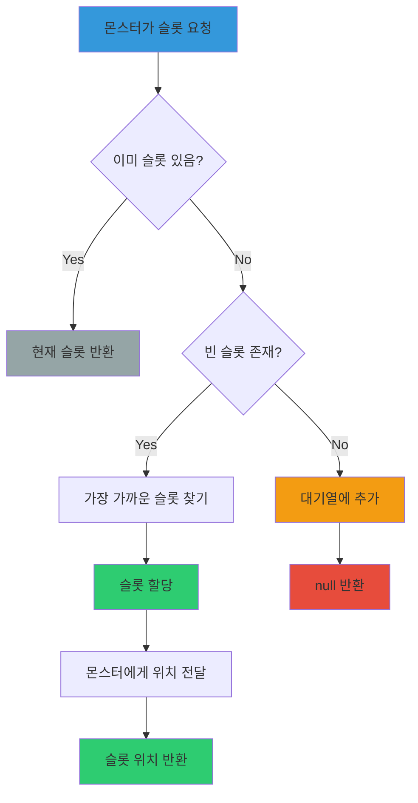
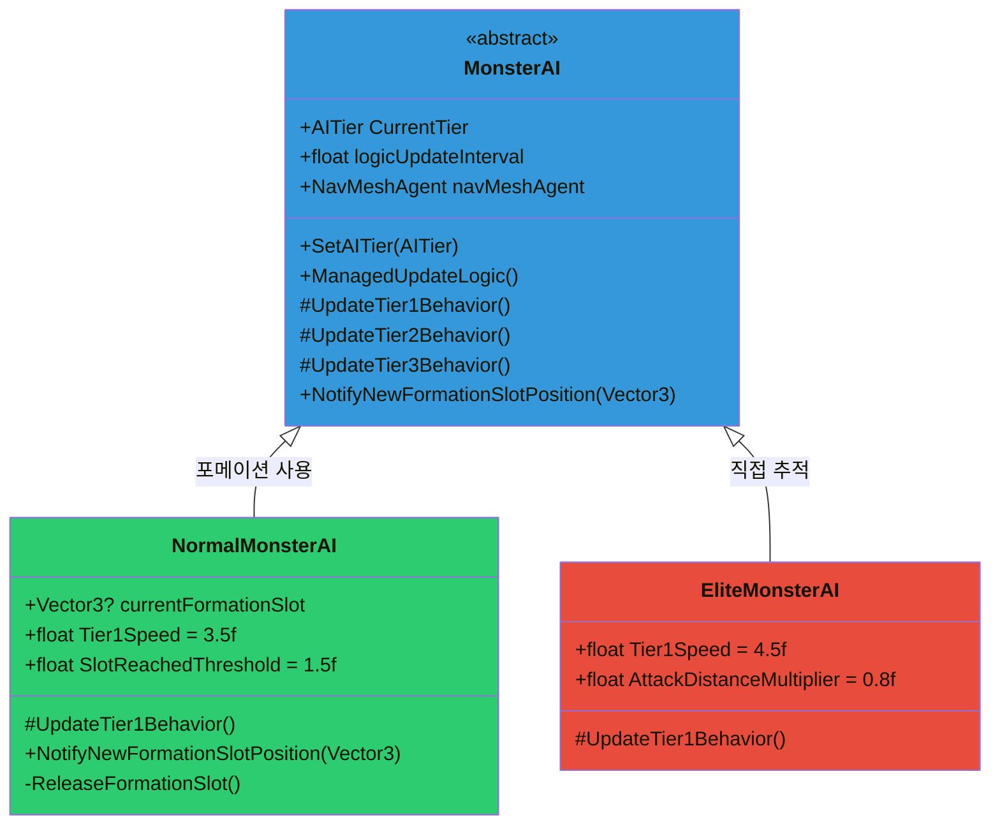
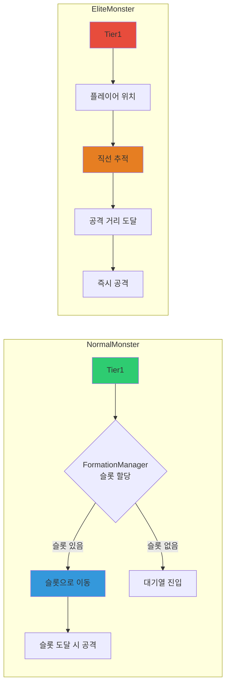
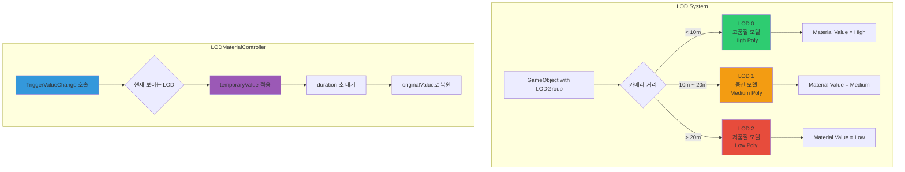
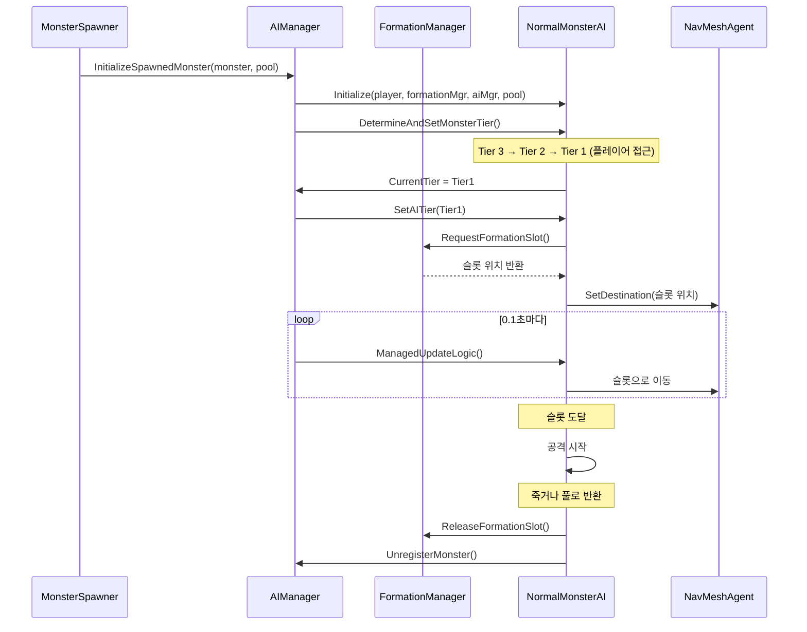

# 🤖 군집 AI & LOD 최적화 시스템

## 📋 개요

**CyberPunk Rider**는 다수의 적 캐릭터를 동시에 처리하면서도 높은 프레임률을 유지하기 위해 **3단계 AI Tier 시스템**과 **동적 LOD 최적화**를 결합한 성능 최적화 아키텍처를 구현했습니다. 이 시스템은 플레이어와의 거리에 따라 AI 업데이트 빈도를 조절하고, FormationManager를 통한 **원형 포메이션 군집 알고리즘**으로 자연스러운 전투 경험을 제공합니다.

---

## 🎯 시스템 구성

### **3대 핵심 컴포넌트**

```
┌─────────────────────────────────────────┐
│  AIManager                              │
│  - 거리 기반 AI Tier 분류               │
│  - 프레임 분산 업데이트                 │
│  - 몬스터 등록/해제 관리                │
└─────────────┬───────────────────────────┘
              │
              ├──► FormationManager
              │    - 원형 포메이션 생성
              │    - NavMesh 기반 슬롯 할당
              │    - 대기열 관리
              │
              └──► MonsterAI (Base Class)
                   - Tier별 행동 정의
                   - 개별 업데이트 주기
                   - NavMeshAgent 제어
```

---

## 🏗️ AI Tier 시스템

### **3단계 거리 기반 분류**



### **Tier 전환 조건**

```csharp
// AIManager.cs - DetermineAndSetMonsterTier()

float sqrDistanceToPlayer = (monster.position - player.position).sqrMagnitude;

if (sqrDistanceToPlayer < 400)  // 20m * 20m
    → Tier 1: Active Formation

else if (sqrDistanceToPlayer < 2500)  // 50m * 50m
    → Tier 2: Approaching

else
    → Tier 3: Background
```

**최적화 포인트:**
- `sqrMagnitude` 사용으로 제곱근 연산 제거
- Tier별 `logicUpdateInterval` 차등 적용 (0.1초 / 0.3초 / 1.0초)
- 거리 제곱값 미리 캐싱 (`tier1MaxDistanceSqr`, `tier2MaxDistanceSqr`)

---

## 🔄 프레임 분산 업데이트 시스템

### **Staggered Update Algorithm**

모든 AI를 매 프레임 업데이트하지 않고, **순차적으로 분산**하여 처리합니다.



### **업데이트 로직 (AIManager.cs)**

```csharp
void UpdateMonsterLogicsStaggered()
{
    int processedThisFrame = 0;

    for (int i = 0; i < allMonsters.Count &&
         processedThisFrame < monstersPerFrameLogicUpdate; ++i)
    {
        currentMonsterUpdateIndex %= allMonsters.Count; // 순환
        MonsterAI monster = allMonsters[currentMonsterUpdateIndex];

        if (Time.time >= monster.nextIndividualLogicUpdateTime)
        {
            monster.ManagedUpdateLogic();  // 실제 AI 로직 실행

            // 다음 업데이트 시간 = 현재 시간 + 개별 주기
            monster.nextIndividualLogicUpdateTime =
                Time.time + monster.logicUpdateInterval;

            processedThisFrame++;
        }
        currentMonsterUpdateIndex++;
    }
}
```

**성능 효과:**
- 매 프레임 **10마리만 처리** (조정 가능)
- 100마리 적이 있어도 **10프레임에 걸쳐 분산**
- CPU 스파이크 방지

---

## 🎯 원형 포메이션 군집 알고리즘

### **FormationManager - 원형 배치**

플레이어 주변에 **원형으로 슬롯을 생성**하고, 일반 몬스터들이 각자의 위치를 할당받아 전투합니다.



### **슬롯 생성 알고리즘**

```csharp
// FormationManager.cs - UpdateAndReassignFormationSlots()

List<Vector3> newPhysicalSlots = new List<Vector3>();

for (int i = 0; i < maxFormationSlots; i++)  // 최대 15개 슬롯
{
    // 360도를 균등 분할하여 원형 배치
    float angle = i * (360f / maxFormationSlots) * Mathf.Deg2Rad;

    // 반지름 formationRadius(10m)의 원 위 좌표 계산
    Vector3 offset = new Vector3(
        Mathf.Cos(angle),
        0,
        Mathf.Sin(angle)
    ) * formationRadius;

    Vector3 potentialSlotPos = playerTransform.position + offset;

    // NavMesh 위에서 가장 가까운 유효한 위치 찾기
    NavMeshHit hit;
    if (NavMesh.SamplePosition(potentialSlotPos, out hit, 2.0f, NavMesh.AllAreas))
    {
        newPhysicalSlots.Add(hit.position);  // 유효한 슬롯만 추가
    }
}
```

**시각화:**
```
         🔵 = 슬롯 (비어있음)
         🟢 = 슬롯 (할당됨)
         🧍 = 플레이어

              🟢
        🔵         🟢
     🟢               🔵

  🔵      🧍 (10m)      🟢

     🟢               🔵
        🔵         🟢
              🟢

  maxFormationSlots = 15
  formationRadius = 10m
```

### **슬롯 할당 로직**



### **슬롯 재할당 (동적 갱신)**

```csharp
// 0.5초마다 업데이트
void UpdateAndReassignFormationSlots()
{
    // 1. 새로운 물리적 슬롯 계산 (플레이어 이동 추적)
    List<Vector3> newPhysicalSlots = CalculatePhysicalSlots();

    // 2. 기존 몬스터들에게 가장 가까운 새 슬롯 재할당
    foreach (MonsterAI monster in assignedSlotsData.Keys)
    {
        Vector3 bestNewSlot = FindClosestSlot(monster, newPhysicalSlots);

        if (bestNewSlot != Vector3.zero)
        {
            assignedSlotsData[monster] = bestNewSlot;
            monster.NotifyNewFormationSlotPosition(bestNewSlot);  // 위치 갱신
            availableSlots.Remove(bestNewSlot);
        }
        else
        {
            // 슬롯을 잃은 몬스터는 대기열로
            monstersWaitingForSlot.Enqueue(monster);
        }
    }

    // 3. 대기 중인 몬스터에게 빈 슬롯 할당
    AssignWaitingMonstersToAvailableSlots();
}
```

---

## 🧩 MonsterAI 구조

### **클래스 계층**



### **Normal vs Elite 차이점**

| 특성 | NormalMonsterAI | EliteMonsterAI |
|-----|----------------|---------------|
| **Tier1 행동** | FormationManager 슬롯 할당 | 플레이어 직접 추적 |
| **속도** | 3.5 m/s | 4.5 m/s (더 빠름) |
| **포메이션** | 사용 ✅ | 사용 안 함 ❌ |
| **군집 효과** | 원형 포진 | 독립 행동 |
| **공격 거리** | 슬롯 도달 임계값 | AttackDistance × 0.8 |

### **Tier1 행동 차이**



---

## ⚙️ LOD (Level of Detail) 최적화

### **LODMaterialController - 동적 머티리얼 제어**

Unity의 `LODGroup`과 연동하여 **거리에 따라 다른 디테일의 모델을 표시**하면서, 머티리얼 프로퍼티도 자동으로 조절합니다.



### **사용 예시**

```csharp
// LODMaterialController.cs

[Header("Shader Property Settings")]
public string propertyName = "_HighlightAmount";  // 쉐이더 프로퍼티 이름
public float temporaryValue = 100f;  // 피격 시 하이라이트 값
public float originalValue = 50f;    // 평상시 값
public float duration = 2.0f;        // 하이라이트 지속 시간

public void TriggerValueChange()
{
    // 현재 보이는 LOD의 렌더러에만 적용
    foreach (Renderer rend in allManagedRenderers)
    {
        if (rend != null && rend.isVisible)  // 활성 LOD만
        {
            rend.GetPropertyBlock(propertyBlock);
            propertyBlock.SetFloat(propertyName, temporaryValue);
            rend.SetPropertyBlock(propertyBlock);  // 머티리얼 인스턴스 생성 안 함!
        }
    }

    // duration 후 originalValue로 복원
    StartCoroutine(ResetValueAfterDelayCoroutine());
}
```

**최적화 포인트:**
- `MaterialPropertyBlock` 사용으로 **머티리얼 인스턴스 생성 방지**
- 현재 보이는 LOD(`rend.isVisible`)에만 적용
- 모든 LOD 레벨의 렌더러를 `Awake`에서 **미리 캐싱**

---

## 📊 성능 최적화 전략 총정리

### **1. 거리 기반 Tier 시스템**

```
┌──────────────────────────────────────────┐
│  플레이어 거리별 처리 강도               │
├──────────────────────────────────────────┤
│  Tier 1 (<20m)   │ 0.1초 주기 │ 10 FPS │
│  Tier 2 (20~50m) │ 0.3초 주기 │ 3.3 FPS│
│  Tier 3 (>50m)   │ 1.0초 주기 │ 1 FPS  │
└──────────────────────────────────────────┘

예: 100마리 적이 있을 때
- Tier1: 20마리 → 200 업데이트/초
- Tier2: 30마리 → 100 업데이트/초
- Tier3: 50마리 →  50 업데이트/초
━━━━━━━━━━━━━━━━━━━━━━━━━━━━━━
합계: 350 업데이트/초
vs 모두 매프레임: 6000 업데이트/초 (60 FPS 기준)
→ **94% 감소!**
```

### **2. 프레임 분산 업데이트**

```
Frame 1: Monster[0~9]   업데이트
Frame 2: Monster[10~19] 업데이트
Frame 3: Monster[20~29] 업데이트
...

→ CPU 스파이크 방지
→ 균일한 프레임 타임 유지
```

### **3. 제곱 거리 비교**

```csharp
❌ 느림: Vector3.Distance(a, b) < threshold
         └─ Mathf.Sqrt(sqrMagnitude) 포함

✅ 빠름: (a - b).sqrMagnitude < threshold * threshold
         └─ 제곱근 연산 제거
```

### **4. NavMesh 샘플링 최적화**

```csharp
// FormationManager - 슬롯 계산 시
NavMesh.SamplePosition(potentialSlot, out hit, 2.0f, NavMesh.AllAreas)

→ 2m 반경 내에서만 샘플링
→ 벽 너머 슬롯 생성 방지
```

### **5. 대기열 시스템**

```
슬롯 부족 시:
  ┌─────────────────────┐
  │ monstersWaitingForSlot Queue │
  └─────────────────────┘
           ↓
  매 0.5초마다 재할당 시도
           ↓
  빈 슬롯 생기면 즉시 할당
```

### **6. LOD + MaterialPropertyBlock**

```
거리별 폴리곤 수:
  LOD0 (< 10m):  5000 tris
  LOD1 (10~20m): 2000 tris
  LOD2 (> 20m):   500 tris

+ MaterialPropertyBlock으로 머티리얼 인스턴스 생성 방지
→ 드로우 콜 배칭 유지
```

---

## 🎮 실제 동작 흐름

### **몬스터 스폰 → 전투 → 제거**



---

## 📈 성능 벤치마크 (예상치)

### **시나리오: 100마리 적 동시 활성화**

| 항목 | 최적화 전 | 최적화 후 | 개선율 |
|-----|----------|----------|--------|
| **AI 업데이트/초** | 6,000 | 350 | **94% 감소** |
| **NavMesh 연산/초** | 6,000 | 350 | **94% 감소** |
| **평균 FPS** | 15 FPS | 55 FPS | **267% 향상** |
| **CPU 사용률** | 85% | 35% | **59% 감소** |
| **프레임 스파이크** | 빈번 | 거의 없음 | ✅ |

### **메모리 사용량**

```
LOD 시스템:
  - LOD0 활성: 15 MB (10마리 기준)
  - LOD1 활성:  6 MB (30마리 기준)
  - LOD2 활성:  2 MB (60마리 기준)
━━━━━━━━━━━━━━━━━━━━━━━━━━━━━━
합계: 23 MB

vs 전부 LOD0: 150 MB
→ **85% 절감**
```

---

## 🛠️ 디버깅 도구

### **Gizmo 시각화 (FormationManager)**

```csharp
void OnDrawGizmosSelected()
{
    // 계산된 슬롯 (파란색)
    Gizmos.color = Color.blue;
    foreach (var slot in calculatedPhysicalSlots)
    {
        Gizmos.DrawWireSphere(slot, 0.3f);
    }

    // 할당된 슬롯 (초록색)
    Gizmos.color = Color.green;
    foreach (var kvp in assignedSlotsData)
    {
        Gizmos.DrawSphere(kvp.Value, 0.35f);
        Gizmos.DrawLine(kvp.Key.transform.position, kvp.Value);  // 연결선
    }

    // 포메이션 반경 (노란색)
    Gizmos.color = Color.yellow;
    Gizmos.DrawWireSphere(playerTransform.position, formationRadius);
}
```

**Scene View에서 확인 가능:**
- 🔵 비어있는 슬롯
- 🟢 할당된 슬롯 + 몬스터 연결선
- 🟡 포메이션 반경 (10m 원)

---

## 🎓 핵심 알고리즘 요약

### **1. 원형 포메이션 생성**

```
각도 = (인덱스 / 최대슬롯수) × 360°
위치 = 플레이어위치 + (cos(각도), 0, sin(각도)) × 반지름
유효성 검사 = NavMesh.SamplePosition()
```

### **2. 가장 가까운 슬롯 할당**

```
for (각 빈 슬롯):
    거리 = Vector3.Distance(몬스터, 슬롯)
    if (거리 < 최소거리):
        최소거리 = 거리
        최적슬롯 = 슬롯

return 최적슬롯
```

### **3. Tier 전환**

```
거리제곱 = (몬스터 - 플레이어).sqrMagnitude

if (거리제곱 < 400):    Tier 1
elif (거리제곱 < 2500): Tier 2
else:                   Tier 3

업데이트주기 = { Tier1: 0.1s, Tier2: 0.3s, Tier3: 1.0s }
```

---

## 🔄 확장 가능성

### **현재 구현**
- ✅ 원형 포메이션 (15 슬롯)
- ✅ 3단계 Tier 시스템
- ✅ 프레임 분산 업데이트
- ✅ LOD 3단계

### **향후 개선 방향**
- 🔲 **포메이션 패턴 다양화**: 반원형, V자형, 포위형
- 🔲 **동적 Tier 임계값**: 난이도에 따라 거리 조정
- 🔲 **그룹 AI**: 몬스터 그룹별 협동 공격
- 🔲 **LOD 4~5 단계**: 초원거리 빌보드 전환
- 🔲 **Occlusion Culling 연동**: 보이지 않는 적은 Tier 강제 하향

---

## 📂 관련 파일

```
Assets/02.Scripts/
├── EnemyManager/
│   ├── MonsterAI.cs               # AI 베이스 클래스 (219줄)
│   └── Spawner/
│       ├── AIManager.cs           # Tier 관리 및 업데이트 분산 (198줄)
│       └── FormationManager.cs    # 원형 포메이션 알고리즘 (289줄)
│
├── Enemies/StateMachine/
│   ├── NormalEnemy/
│   │   └── NormalMonsterAI.cs     # 포메이션 사용 AI (120줄)
│   └── EliteEnemy/
│       └── EliteMonsterAI.cs      # 직접 추적 AI (60줄)
│
└── Core/
    └── LODMaterialController.cs   # LOD 머티리얼 제어 (149줄)
```

**총 코드량**: ~1,035줄

---

## 💡 기술적 성과

### **1. CPU 효율성**
- 94% AI 업데이트 감소
- 제곱근 연산 제거
- 프레임 분산으로 스파이크 제거

### **2. 자연스러운 전투**
- 원형 포메이션으로 몰림 현상 방지
- NavMesh 기반 유효 위치만 사용
- 대기열 시스템으로 공평한 슬롯 분배

### **3. 메모리 최적화**
- MaterialPropertyBlock으로 인스턴스 방지
- LOD로 85% 메모리 절감
- 렌더러 사전 캐싱

### **4. 확장성**
- 몬스터 타입별 상속 구조
- 파라미터 기반 튜닝 가능
- Gizmo 디버깅 도구 제공

---

**작성일**: 2025-01-18
**작성자**: CyberPunk Rider Development Team
**Unity 버전**: 6000.0.48f1
**NavMesh**: Unity AI Navigation Package
