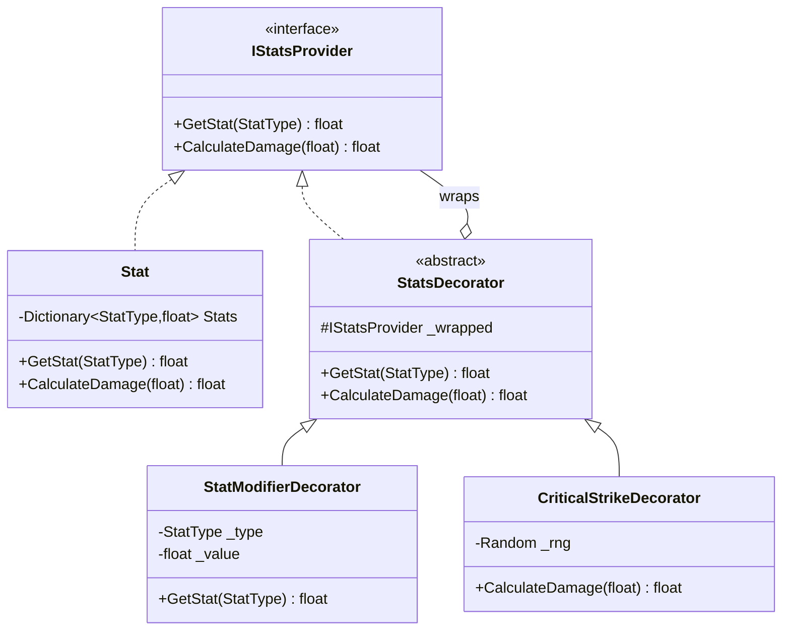
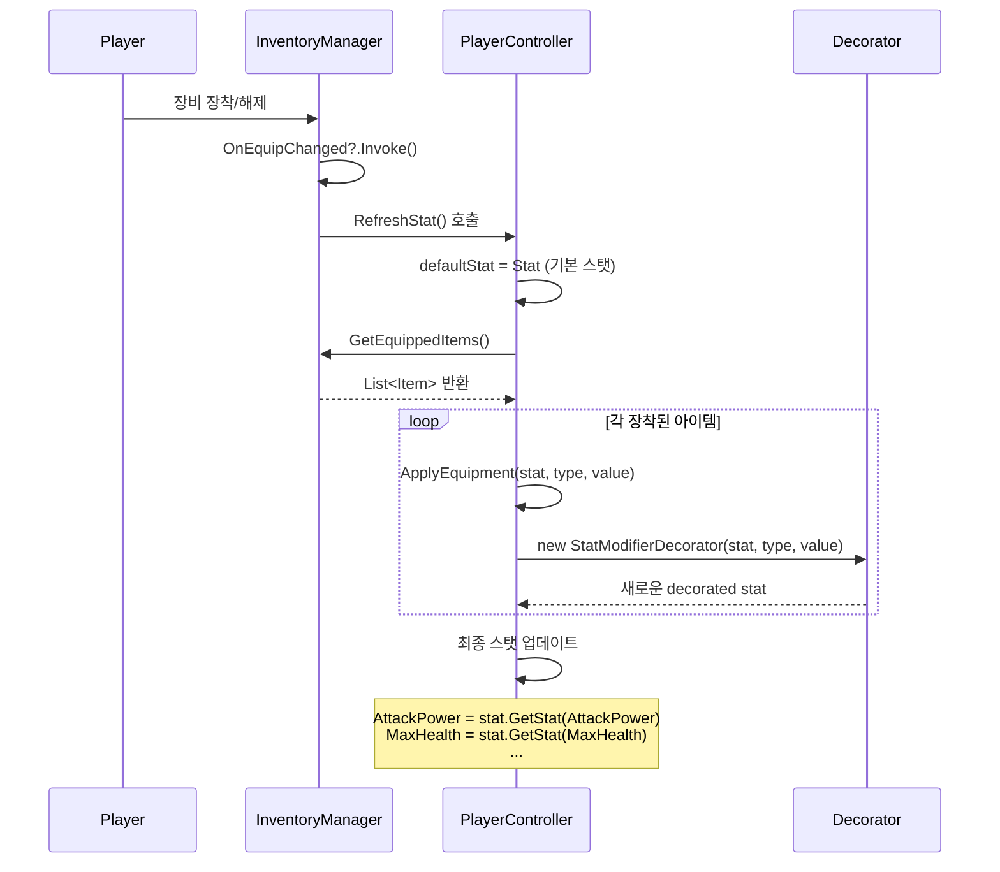
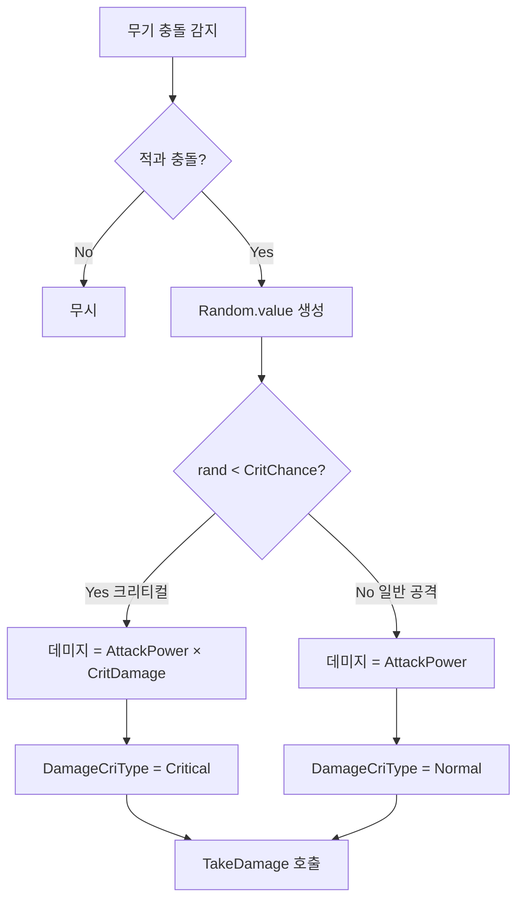

# 장비 시스템 - 데코레이터 패턴 기반 스탯 시스템

## 📋 목차
1. [시스템 개요](#시스템-개요)
2. [데코레이터 패턴 구조](#데코레이터-패턴-구조)
3. [스탯 타입 및 인터페이스](#스탯-타입-및-인터페이스)
4. [장비 장착 메커니즘](#장비-장착-메커니즘)
5. [크리티컬 데미지 시스템](#크리티컬-데미지-시스템)
6. [장비 데이터 구조](#장비-데이터-구조)
7. [코드 참조](#코드-참조)

---

## 시스템 개요

본 프로젝트는 **데코레이터 패턴(Decorator Pattern)**을 활용하여 장비 착용 시 플레이어 스탯을 동적으로 증가시키는 시스템을 구현했습니다. 이 패턴을 사용하면:

- ✅ **런타임 스탯 조합**: 장비를 장착/해제할 때마다 스탯을 동적으로 재계산
- ✅ **무한 중첩 가능**: 여러 장비를 착용하면 각 장비의 스탯이 누적
- ✅ **확장성**: 새로운 스탯 타입이나 버프를 쉽게 추가 가능
- ✅ **유지보수성**: 각 데코레이터가 독립적이므로 수정이 용이

### 핵심 장점
```
기본 스탯 → 무기 장착 → 방어구 장착 → 버프 적용 → 최종 스탯
   (Stat)   (Decorator1)  (Decorator2)   (Decorator3)   (Result)
```

---

## 데코레이터 패턴 구조

### 아키텍처 다이어그램



### 클래스별 역할

| 클래스 | 역할 | 파일 위치 |
|--------|------|-----------|
| `IStatsProvider` | 스탯 제공 인터페이스 | `Assets/02.Scripts/Stat/Stat.cs:15` |
| `Stat` | 기본 스탯 구현 클래스 | `Assets/02.Scripts/Stat/Stat.cs:21` |
| `StatsDecorator` | 데코레이터 추상 클래스 | `Assets/02.Scripts/Stat/StatsDecorator.cs:4` |
| `StatModifierDecorator` | 스탯 수치 증가 데코레이터 | `Assets/02.Scripts/Stat/StatModifierDecorator.cs:4` |
| `CriticalStrikeDecorator` | 크리티컬 데미지 계산 데코레이터 | `Assets/02.Scripts/Stat/CriticalStrikeDecorator.cs:5` |

---

## 스탯 타입 및 인터페이스

### StatType 열거형
```csharp
// Assets/02.Scripts/Stat/Stat.cs:3
public enum StatType
{
    Health,          // 체력
    MaxHealth,       // 최대 체력
    AttackPower,     // 공격력
    Defense,         // 방어력
    Speed,           // 이동 속도
    AttackSpeed,     // 공격 속도
    CritChance,      // 크리티컬 확률 (0.0 ~ 1.0)
    CritDamage       // 크리티컬 데미지 배율
}
```

### IStatsProvider 인터페이스
```csharp
// Assets/02.Scripts/Stat/Stat.cs:15
public interface IStatsProvider
{
    float GetStat(StatType statType);        // 특정 스탯 값 반환
    float CalculateDamage(float baseDamage); // 최종 데미지 계산
}
```

### 기본 Stat 클래스
```csharp
// Assets/02.Scripts/Stat/Stat.cs:21
public class Stat : IStatsProvider
{
    private readonly Random _rng = new Random();
    public Dictionary<StatType, float> Stats;

    public Stat(Dictionary<StatType, float> statDict)
    {
        Stats = statDict;
    }

    // Dictionary에서 스탯 조회 (없으면 0 반환)
    public float GetStat(StatType type)
    {
        return Stats.TryGetValue(type, out float value) ? value : 0f;
    }

    // 기본 데미지 계산 (공격력 + 크리티컬)
    public float CalculateDamage(float baseDamage)
    {
        float attackPower = GetStat(StatType.AttackPower);
        float critChance = GetStat(StatType.CritChance);
        float critDamage = GetStat(StatType.CritDamage);

        bool isCritical = _rng.NextDouble() < critChance;
        float damage = baseDamage + attackPower;

        if (isCritical)
            damage *= critDamage;

        return (float)Math.Round(damage);
    }
}
```

---

## 데코레이터 구현

### 1. StatsDecorator (추상 클래스)
```csharp
// Assets/02.Scripts/Stat/StatsDecorator.cs:4
public abstract class StatsDecorator : IStatsProvider
{
    protected IStatsProvider _wrapped; // 감싸고 있는 스탯 제공자

    protected StatsDecorator(IStatsProvider wrapped)
    {
        _wrapped = wrapped;
    }

    // 기본적으로 내부 객체에 위임
    public virtual float GetStat(StatType statType)
    {
        return _wrapped.GetStat(statType);
    }

    public virtual float CalculateDamage(float baseDamage)
    {
        return _wrapped.CalculateDamage(baseDamage);
    }
}
```

### 2. StatModifierDecorator (스탯 증가)
```csharp
// Assets/02.Scripts/Stat/StatModifierDecorator.cs:4
/// <summary>
/// 스탯 수치 증가 데코레이터 (예: 무기, 방어구, 버프)
/// </summary>
public class StatModifierDecorator : StatsDecorator
{
    private readonly StatType _type;  // 증가시킬 스탯 종류
    private readonly float _value;    // 증가량

    public StatModifierDecorator(IStatsProvider wrapped, StatType type, float value)
        : base(wrapped)
    {
        _type = type;
        _value = value;
    }

    public override float GetStat(StatType statType)
    {
        // 해당 스탯이면 기본값 + 증가량 반환
        if (statType == _type)
            return base.GetStat(statType) + _value;
        return base.GetStat(statType);
    }
}
```

### 3. CriticalStrikeDecorator (크리티컬 계산)
```csharp
// Assets/02.Scripts/Stat/CriticalStrikeDecorator.cs:5
/// <summary>
/// 크리티컬 데미지 커스터마이징 (선택사항)
/// </summary>
public class CriticalStrikeDecorator : StatsDecorator
{
    private readonly Random _rng = new Random();

    public CriticalStrikeDecorator(IStatsProvider wrapped) : base(wrapped) { }

    public override float CalculateDamage(float baseDamage)
    {
        float attackPower = GetStat(StatType.AttackPower);
        float critChance = GetStat(StatType.CritChance);
        float critDamage = GetStat(StatType.CritDamage);

        bool isCritical = _rng.NextDouble() < critChance;
        float damage = baseDamage + attackPower;

        if (isCritical)
        {
            damage *= critDamage;
        }

        return (float)Math.Round(damage);
    }
}
```

---

## 장비 장착 메커니즘

### 장비 장착 흐름도



### PlayerController의 스탯 갱신 메서드

```csharp
// Assets/02.Scripts/Player/PlayerController.cs:44
public IStatsProvider Stat { get; private set; }

// Assets/02.Scripts/Player/PlayerController.cs:374
public IStatsProvider ApplyEquipment(IStatsProvider newStat, StatType statType, float value)
{
    return new StatModifierDecorator(newStat, statType, value);
}

// Assets/02.Scripts/Player/PlayerController.cs:732
public void RefreshStat()
{
    // 스탯을 기본값으로 초기화
    IStatsProvider defaultStat = Stat;

    // 장착된 모든 아이템 가져오기
    List<Item> equippedItems = InventoryManager.Instance.GetEquippedItems();

    // 각 아이템의 스탯을 데코레이터로 추가
    foreach(Item item in equippedItems)
    {
        defaultStat = ApplyEquipment(defaultStat, StatType.MaxHealth, item.MaxHealth);
        defaultStat = ApplyEquipment(defaultStat, StatType.AttackPower, item.AttackPower);
        defaultStat = ApplyEquipment(defaultStat, StatType.Defense, item.Defense);
        defaultStat = ApplyEquipment(defaultStat, StatType.Speed, item.Speed);
        defaultStat = ApplyEquipment(defaultStat, StatType.AttackSpeed, item.AttackSpeed);
        defaultStat = ApplyEquipment(defaultStat, StatType.CritChance, item.CritChance);
        defaultStat = ApplyEquipment(defaultStat, StatType.CritDamage, item.CritDamage);
    }

    // 최종 스탯을 플레이어 변수에 반영
    AttackPower = defaultStat.GetStat(StatType.AttackPower);
    MaxForwardSpeed = defaultStat.GetStat(StatType.Speed);
    MaxHealth = defaultStat.GetStat(StatType.MaxHealth);
    CritChance = defaultStat.GetStat(StatType.CritChance);
    CritDamage = defaultStat.GetStat(StatType.CritDamage);
}
```

### 데코레이터 중첩 예시

```
초기 상태:
  Stat { AttackPower: 100 }

무기 장착 (+50 공격력):
  StatModifierDecorator(Stat, AttackPower, 50)
  → GetStat(AttackPower) = 100 + 50 = 150

방어구 장착 (+30 공격력):
  StatModifierDecorator(무기Decorator, AttackPower, 30)
  → GetStat(AttackPower) = 150 + 30 = 180

버프 적용 (+20 공격력):
  StatModifierDecorator(방어구Decorator, AttackPower, 20)
  → GetStat(AttackPower) = 180 + 20 = 200
```

---

## 크리티컬 데미지 시스템

### 무기 공격 로직 (Sword 클래스)

```csharp
// Assets/02.Scripts/Inventory/Equipment/Weapon/Sword.cs:15
private bool IsCriticalHit()
{
    float rand = Random.value; // 0.0f ~ 1.0f 사이의 무작위 값
    return rand < _playerController.CritChance;
}

// Assets/02.Scripts/Inventory/Equipment/Weapon/Sword.cs:20
private void OnTriggerEnter(Collider collision)
{
    IDamageable damageable = collision.gameObject.GetComponent<IDamageable>();

    if (collision.gameObject.layer == LayerMask.NameToLayer("Player"))
        return;

    if (damageable != null)
    {
        Damage damage = new Damage();
        damage.DamageForce = 1f;
        damage.DamageType = _playerController.DamageType;

        // 크리티컬 판정
        if(IsCriticalHit())
        {
            damage.DamageValue = (int)(_playerController.AttackPower * _playerController.CritDamage);
            damage.DamageCriType = EDamageCriType.Critical;
        }
        else
        {
            damage.DamageValue = (int)_playerController.AttackPower;
            damage.DamageCriType = EDamageCriType.Normal;
        }

        damage.From = transform.root.gameObject;
        damageable.TakeDamage(damage);
    }
}
```

### 크리티컬 계산 흐름



---

## 장비 데이터 구조

### EquipmentDataSO (ScriptableObject)

```csharp
// Assets/02.Scripts/Inventory/Equipment/EquipmentDataSO.cs:3
public enum EquipmentType { Weapon, Armor, Head, Boots }

public enum SetItemType
{
    None     = 0,
    SetItem1 = 1 << 0,  // 비트 플래그 (세트 아이템)
    SetItem2 = 1 << 1,
    SetItem3 = 1 << 2,
    SetItem4 = 1 << 3,
    SetItem5 = 1 << 4
}

// Assets/02.Scripts/Inventory/Equipment/EquipmentDataSO.cs:14
[CreateAssetMenu(fileName = "EquipmentData", menuName = "Scriptable Objects/EquipmentData")]
public class EquipmentDataSO : ItemBaseDataSO
{
    public new ItemType ItemType => ItemType.Equipment;

    public string EquipmentName;
    public SetItemType SetItemType;
    public EquipmentType EquipmentType;
    public GameObject ModelPrefab;

    // 아이콘 크기
    // Weapon = 200 x 400
    // Head = 200 x 200
    // Armor = 300 x 300
    // Boots = 200 x 200
    public Sprite EquipmentSprite;
}
```

### Item 클래스 (런타임 인스턴스)

```csharp
// Assets/02.Scripts/Inventory/UI_Inventory/Item.cs:29
[Serializable]
public class Item
{
    public string Id;
    public int SoIndex;
    public ItemBaseDataSO Data;
    public bool IsEquipped;

    // 장비 스탯 (런타임에 랜덤 생성 가능)
    public float MaxHealth = 0.0f;
    public float AttackPower = 0.0f;
    public float Defense = 0.0f;
    public float Speed = 0.0f;
    public float AttackSpeed = 0.0f;
    public float CritChance = 0.0f;
    public float CritDamage = 0.0f;

    public SetItemType SetItemType;
    public List<CubeStat> CubeStats = new List<CubeStat>(); // 추가 옵션

    // 슬롯 관리
    public void SetSlotIndex(SlotType slotType, int slotIndex)
    {
        _slotType = slotType;
        _slotIndex = slotIndex;

        // Equipment 슬롯이면 장착 상태
        if (_slotType == SlotType.Equipment)
            IsEquipped = true;

        // Inventory 슬롯이면 장착 해제
        if (_slotType == SlotType.Inventory)
            IsEquipped = false;
    }
}
```

### CubeStat (추가 옵션)

```csharp
// Assets/02.Scripts/Inventory/UI_Inventory/Item.cs:5
public class CubeStat
{
    public StatType StatType;
    public float Value;

    public CubeStat(StatType statType, float value)
    {
        StatType = statType;
        Value = value;
    }
}
```

---

## 인벤토리 연동

### InventoryManager

```csharp
// Assets/02.Scripts/Inventory/UI_Inventory/InventoryManager.cs:15
[System.Serializable]
public class InventoryManager : Singleton<InventoryManager>
{
    public List<Item> _items = new List<Item>();
    public Action OnDataChanged;   // 인벤토리 데이터 변경 이벤트
    public Action OnEquipChanged;  // 장비 변경 이벤트

    // 장착된 아이템만 필터링
    public List<Item> GetEquippedItems()
    {
        return _items.FindAll(item => item.IsEquipped);
    }

    // 아이템 추가
    public bool Add(Item item)
    {
        if (UI_InventoryPopup.Instance.IsInventoryFull() == false)
        {
            _items.Add(item);
            OnDataChanged?.Invoke();
            Save();
            return true;
        }
        return false;
    }

    // 장비 장착 (플레이어 스탯 갱신 트리거)
    public void Equip(Item item)
    {
        OnEquipChanged?.Invoke();
    }

    // 아이템 제거
    public void Remove(Item item)
    {
        bool removed = _items.Remove(item);
        if (removed)
        {
            OnDataChanged?.Invoke();
            Save();
        }
    }
}
```

---

## 코드 참조

### 핵심 파일 목록

| 파일 경로 | 설명 |
|----------|------|
| `Assets/02.Scripts/Stat/Stat.cs` | StatType 열거형, IStatsProvider 인터페이스, Stat 기본 클래스 |
| `Assets/02.Scripts/Stat/StatsDecorator.cs` | 데코레이터 추상 클래스 |
| `Assets/02.Scripts/Stat/StatModifierDecorator.cs` | 스탯 증가 데코레이터 |
| `Assets/02.Scripts/Stat/CriticalStrikeDecorator.cs` | 크리티컬 계산 데코레이터 |
| `Assets/02.Scripts/Player/PlayerController.cs:374` | ApplyEquipment 메서드 |
| `Assets/02.Scripts/Player/PlayerController.cs:732` | RefreshStat 메서드 |
| `Assets/02.Scripts/Inventory/Equipment/EquipmentDataSO.cs` | 장비 데이터 SO |
| `Assets/02.Scripts/Inventory/UI_Inventory/Item.cs` | Item 런타임 클래스 |
| `Assets/02.Scripts/Inventory/UI_Inventory/InventoryManager.cs:21` | GetEquippedItems 메서드 |
| `Assets/02.Scripts/Inventory/Equipment/Weapon/Sword.cs:15` | 크리티컬 판정 로직 |

### 주요 메서드 참조

```csharp
// 스탯 조회
float attackPower = player.Stat.GetStat(StatType.AttackPower);

// 데미지 계산
float finalDamage = player.Stat.CalculateDamage(100f); // 기본 데미지 100

// 장비 적용 (데코레이터 생성)
IStatsProvider newStat = player.ApplyEquipment(player.Stat, StatType.AttackPower, 50);

// 전체 스탯 갱신 (장비 장착/해제 시)
player.RefreshStat();

// 장착된 아이템 목록
List<Item> equipped = InventoryManager.Instance.GetEquippedItems();
```

---

## 사용 예시

### 1. 플레이어 초기화
```csharp
void Start()
{
    // 기본 스탯 생성
    Dictionary<StatType, float> baseStats = new Dictionary<StatType, float>
    {
        { StatType.Health, 1000 },
        { StatType.AttackPower, 100 },
        { StatType.CritChance, 0.1f },
        { StatType.CritDamage, 1.5f }
    };

    player.Stat = new Stat(baseStats);
}
```

### 2. 장비 장착
```csharp
void EquipWeapon(Item weaponItem)
{
    // 아이템을 장비 슬롯으로 이동
    weaponItem.SetSlotIndex(SlotType.Equipment, 0);

    // 인벤토리 매니저에 알림
    InventoryManager.Instance.Equip(weaponItem);

    // 플레이어 스탯 갱신 (OnEquipChanged 이벤트로 자동 호출 가능)
    player.RefreshStat();
}
```

### 3. 공격 시 크리티컬 판정
```csharp
void Attack()
{
    float baseDamage = 50f;
    float finalDamage = player.Stat.CalculateDamage(baseDamage);

    Debug.Log($"Final Damage: {finalDamage}");
    // 크리티컬 발생 시: baseDamage + AttackPower * CritDamage
    // 일반 공격 시: baseDamage + AttackPower
}
```

---

## 요약

### 데코레이터 패턴의 장점
- 📦 **모듈화**: 각 스탯 증가 로직이 독립적인 데코레이터 클래스
- 🔄 **동적 조합**: 런타임에 장비를 자유롭게 추가/제거 가능
- 🚀 **확장성**: 새로운 버프/디버프를 데코레이터로 쉽게 추가
- 🧪 **테스트 용이성**: 각 데코레이터를 독립적으로 테스트 가능

### 시스템 흐름 요약
```
1. 기본 Stat 객체 생성 (PlayerController.Stat)
2. 장비 장착 시 RefreshStat() 호출
3. GetEquippedItems()로 장착된 아이템 목록 가져오기
4. 각 아이템의 스탯을 StatModifierDecorator로 감싸기
5. 최종 decorated stat에서 GetStat()으로 값 조회
6. 공격 시 CalculateDamage()로 크리티컬 계산
```

### 확장 가능성
- ⚡ 버프/디버프 시스템 (시간 제한 데코레이터)
- 🎲 세트 아이템 보너스 (SetItemDecorator)
- 🔮 임시 포션 효과 (TemporaryStatDecorator)
- 🛡️ 방어력 기반 데미지 감소 (DefenseDecorator)

---

**작성일**: 2025
**Unity 버전**: 6000.0.48f1
**디자인 패턴**: Decorator Pattern
